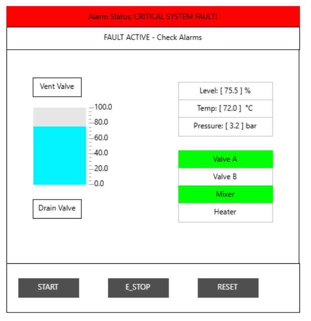

# Chemical Reactor Batch Process & Safety Interlock System

## Project Overview
This project is a simulation of a chemical reactor batch process. It is made in **CODESYS V3.5** (CODESYS Control Win V3) and follows the **IEC 61131-3** standard.

The system runs a full batch sequence: fill the tank, add a chemical, mix, heat and drain. Software safety interlocks watch temperature, pressure and level. A visualization (HMI) shows the process in real time.

**Author:** Khazar Tarverdiyev
**Drawing:** P&ID-101 (Reactor Control System P&ID, dated 01.10.2026)

> **Note:** This is a learning project. The sensor values are entered manually (forced) to test the logic and to demonstrate the HMI. There is no real hardware or real process.

## Key Features
- **Sequential batch control:** A state machine controls the steps Fill, Add Chemical, Mix, Heat and Drain. Every step (except Mix, which has its own mixing time) has a timeout. If a step takes too long, the system goes to the fault state.
- **Software safety interlocks:** The program checks maximum temperature, pressure and level. It also checks the E-stop button.
- **Dry-run protection:** The mixer and the heater cannot run if the tank level is too low.
- **Latching fault logic:** After a fault, the system stays in the fault state until the cause is cleared and the operator presses Reset.
- **Reusable recipe:** Target values are saved in a structure (`Recipe_Data`), so it is easy to change the recipe.
- **WebVisu HMI:** The screen shows tank level, temperature, pressure, actuator status and alarm messages.

## Technical Specifications
| Item | Description |
| :--- | :--- |
| Software | CODESYS V3.5, CODESYS Control Win V3 (x64) |
| Languages | Structured Text (ST) for the sequence, Ladder Diagram (LD) for the interlocks |
| Visualization | TargetVisu and WebVisu |
| Tasks | `MainTask` runs `PLC_PRG`; `VISU_TASK` runs the visualization |

## Process Description (P&ID-101)
| Tag | Equipment | Function |
| :--- | :--- | :--- |
| TK-101 | Base liquid tank | Supplies the base liquid |
| V-101 (Valve A) | Inlet valve | Fills the reactor with base liquid |
| V-102 (Valve B) | Inlet valve | Adds the chemical |
| M-101 | Mixer motor | Mixes the liquids |
| E-101 | Heater element | Heats the reactor |
| V-103 | Drain valve | Empties the reactor |
| V-104 | Vent valve | Releases pressure to the vent |
| LT-101 | Level transmitter | Measures the level |
| TT-101 | Temperature transmitter | Measures the temperature |
| PT-101 | Pressure transmitter | Measures the pressure |

## Batch Sequence
| State | Name | Action | Exit condition |
| :--- | :--- | :--- | :--- |
| 0 | Idle | All actuators are OFF | Start button pressed (rising edge) |
| 1 | Fill Tank | Valve A open | Level ≥ `TargetLevelA` (50 %) |
| 2 | Add Chemical | Valve B open | Level ≥ `TargetLevelA` + `TargetAmountB` (70 %) |
| 3 | Mix | Mixer ON | Mix time is finished (5 s) |
| 4 | Heat | Heater ON | Temperature ≥ `TargetTemp` (80 °C) |
| 5 | Drain | Drain valve open | Level < 0.5 %, then back to State 0 |
| 99 | Fault | All actuators are OFF | No fault and operator Reset |

**Step timeout:** In States 1, 2, 4 and 5, a 10-second timer (`StepTimer`) runs. If the step is not finished in 10 seconds, `StepFault` becomes TRUE and the system goes to State 99.

**Dry-run protection:** In States 3 and 4, if the level is below `MinLevelLimit` (10 %), `StepFault` becomes TRUE and the system goes to State 99.

## Safety Cause & Effect Matrix
| Cause (event) | Alarm / indication | Automatic safety action | Reset requirement |
| :--- | :--- | :--- | :--- |
| **High temperature** (> 90 °C) | `TempAlarm` | `SystemFault` is set, all actuators OFF, State 99 | Temperature back to normal + operator Reset |
| **High pressure** (> 6.0 bar) | `VentValve` opens | Vent valve opens to release pressure, `SystemFault` is set, State 99 | Pressure back to normal + operator Reset |
| **High level** (> 80 %) | Critical System Fault | `SystemFault` is set, all actuators OFF, State 99 | Level back to normal + operator Reset |
| **E-stop pressed** | Critical System Fault | `SystemFault` is set, all actuators OFF, State 99 | E-stop released + operator Reset |
| **Step timeout** (> 10 s) | Critical System Fault | `StepFault` is set, all actuators OFF, State 99 | Operator Reset |
| **Low level** (< 10 %) in Mix or Heat | Critical System Fault | `StepFault` is set, mixer and heater OFF, State 99 | Operator Reset |

### How the fault logic works
- In the `Interlock` ladder program, `TempFault`, `PressureFault` and `LevelFault` are normal coils. They are TRUE only while the limit is exceeded.
- The **latch** is on `SystemFault`. Any fault (or E-stop) sets it with a Set coil. It stays TRUE even if the value goes back to normal.
- `SystemFault` is reset with a Reset coil only when **all** these conditions are true: the Reset button has a rising edge (`R_TRIG`), the E-stop is released, and there is no active fault.
- The Set rung is below the Reset rung. This means that if a fault is still active, the Set has priority.
- `E_StopButton` is TRUE in normal state (normally closed contact). If the wire breaks, the signal becomes FALSE and the system stops. This is a fail-safe design.

## Code Architecture
| Name | Type | Description |
| :--- | :--- | :--- |
| `GVL_Variables` | GVL | Global variables: sensor values, buttons and safety flags |
| `Interlock` | PRG (LD) | Safety logic: limit checks, fault latching, vent valve |
| `PLC_PRG` | PRG (ST) | Batch state machine, step timers, HMI texts |
| `Recipe_Data` | STRUCT | Recipe: `TargetLevelA`, `TargetAmountB`, `MixTime`, `TargetTemp` |

`PLC_PRG` calls `Interlock` in every scan cycle, before the state machine. Because of this, the safety logic always has priority over the sequence.

## HMI and Process Visualization
Sensor values are entered manually (forced) to demonstrate the HMI.

## Limitations
- This is a learning project, and the sensor values are simulated.
- The interlocks are software only, in a standard PLC program. A real plant needs a certified safety system (for example a safety PLC or hardwired E-stop, IEC 61511) and mechanical protection such as a pressure safety valve (PSV).
- The sensor signals have no range check, so a broken sensor wire is not detected.
- The timeout is the same (10 s) for all steps.

##  Future Improvements

I plan to upgrade and expand this simulation project with the following features and enhancements:

- **Sensor Wire-Break Detection:** Implement signal range checks (e.g., detecting out-of-range 4–20 mA signals) to automatically identify sensor faults or disconnected wiring.
- **Individual Step Timeouts:** Move away from a fixed 10-second timer by adding customizable step timeout parameters inside the `Recipe_Data` structure.
- **Updated P&ID Instrumentation:** Add proper alarm tags (`TAH`, `PAH`, `LAH`) and draw a mechanical Pressure Safety Valve (PSV) on the reactor vessel diagram for true process safety compliance.
- **PID Temperature Control:** Replace the simple ON/OFF heating logic with a tuned PID block to maintain precise target temperatures without overshoot.
- **Batch Tracking & Alarm Logging:** Build a batch counter to track total completed cycles and integrate an active alarm history table directly into the WebVisu HMI.
